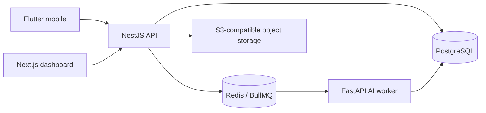

# System architecture

AI-MARKS separates user interfaces, business logic, asynchronous AI processing, durable records, queues, and object storage.

The NestJS API is the business authority. AI output is advisory and cannot finalize examination marks. All tenancy, authorization, verification, calculation, and audit rules remain outside model inference.

## Phase boundary

Phase 1 establishes deployable application boundaries and local infrastructure. It does not implement the Phase 2 database model or Phase 3 authentication.

