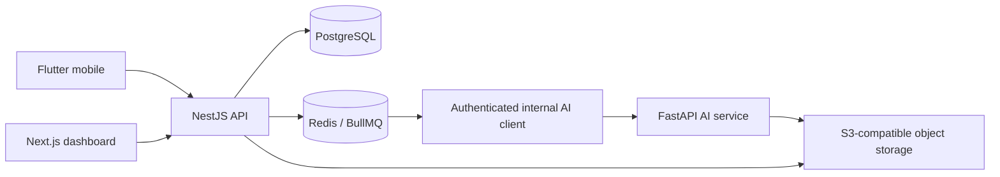

# System architecture

AI-MARKS separates user interfaces, business logic, asynchronous AI processing, durable records, queues, and object storage.

The NestJS API is the business authority. AI output is advisory and cannot finalize examination marks. All tenancy, authorization, verification, calculation, persistence, and audit rules remain outside model inference. The AI service receives tenant-scoped object references over an authenticated internal API and does not connect directly to PostgreSQL.

Verified report data flows through the NestJS export service into private object storage.
PostgreSQL retains export status, filters, requester, checksum-linked file metadata, and
expiry; clients receive only short-lived signed downloads.

## Phase boundary

Phases 10–12 implement image preprocessing, configurable normalized template cells,
checksummed ONNX inference, and a tenant-scoped Redis Stream worker. The Python service
returns advisory per-mark results only. NestJS remains the sole database writer and must
validate, audit, and authorize every later correction or finalization.
