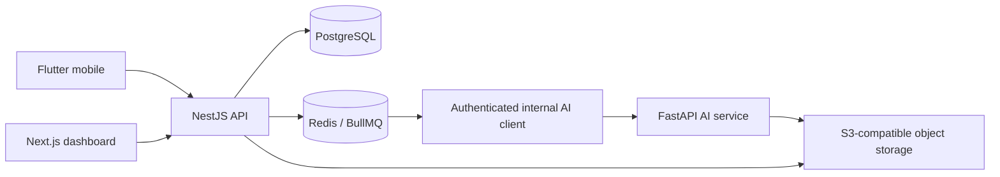

# System architecture

AI-MARKS separates user interfaces, business logic, asynchronous AI processing, durable records, queues, and object storage.

The NestJS API is the business authority. AI output is advisory and cannot finalize examination marks. All tenancy, authorization, verification, calculation, persistence, and audit rules remain outside model inference. The AI service receives tenant-scoped object references over an authenticated internal API and does not connect directly to PostgreSQL.

## Phase boundary

Phase 9 establishes the typed and authenticated Python service boundary. Image preprocessing,
cell detection, handwriting recognition, and queue-driven orchestration remain Phases 10–12.
